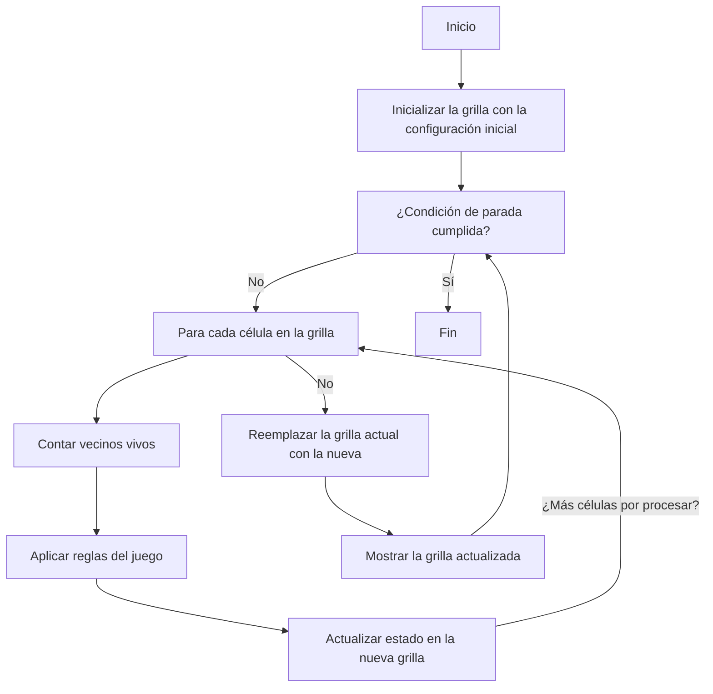

# Trabajo Práctico 2 - Algoritmia 2024

Demo: https://algoritmia-tp-final-2.vercel.app

## El Juego de la Vida

### Introducción

¿Cuáles son las leyes de la vida? ¿La complejidad de la vida a nuestro alrededor se debe a un gran conjunto de leyes sofisticadas o será que un número pequeño de leyes sencillas puede generar patrones de vida complejos?

En 1970, el matemático **John Horton Conway** creó un experimento llamado **El Juego de la Vida**, basado en tres reglas fundamentales: **nacimiento**, **muerte** y **supervivencia**.

El juego se desarrolla sobre una grilla cuadriculada donde cada cuadrado puede estar vacío o contener una célula. A partir de una posición inicial, el sistema evoluciona según las siguientes reglas:

1. Si un cuadrado vacío está rodeado por tres células vecinas, **se crea vida**, agregando una célula en ese lugar.
2. Si una célula tiene menos de dos células vecinas, **muere por aislamiento** y el cuadrado queda vacío. Si tiene más de tres células vecinas, **muere por sofocación**, liberando su espacio.
3. Una célula con **exactamente dos o tres células vecinas** sobrevive a la siguiente instancia del juego.

Sorprendentemente, con estas reglas simples, el juego genera patrones complejos que pueden ser estáticos, dinámicos o incluso interactuar entre sí.

## Consignas

1. **Diagramar un algoritmo** para simular el Juego de la Vida.
2. El trabajo es de **realización personal**. Cada alumno elige el lenguaje de programación a utilizar.
3. El juego será para un **solo jugador**, quien proporcionará la configuración inicial de la grilla.
4. Las generaciones del juego deberán **mostrarse en pantalla cada 2 segundos**.
5. La grilla tendrá un tamaño de:
   - **30 x 30** o
   - **55 x 55** (el jugador elige el tamaño al iniciar el juego).
6. El programa debe informar cuántas generaciones logró el jugador a partir de su configuración inicial.
7. **Investigar y sacar conclusiones** acerca del problema del Juego de la Vida.

---

## Diagrama de flujo del algoritmo del Juego de la Vida

## Consideraciones técnicas

Decidí utilizar **React + TypeScript + Vite** para la realización de este trabajo práctico. No es muy performante la forma en la que se renderiza la grilla, pero es una buena forma de mostrar cómo se comporta el juego de la vida en un entorno web.

Algunas mejoras potenciales serían:

- Implementar el algoritmo **Hashlife** para optimizar el cálculo de las generaciones. Esto permitiría manejar grillas muy grandes de forma eficiente.
- Utilizar **Web Workers** para realizar los cálculos de las generaciones en un thread aparte.
- Utilizar **Canvas** para renderizar la grilla, en lugar de instancias del componente `Cell`. Tambien se podría utilizar **SVG** o **WebGL**. Para grillas muy grandes, esto sería mucho más performante. Actualmente se renderiza un componente por cada celda, lo cual no es muy performante. Por ejemplo para una grilla de `200x200`, se renderizan 40.000 componentes, y 40.000 elementos en el DOM. Esto es MUY ineficiente pero es suficiente para mostrar el funcionamiento del juego de la vida.
- Utilizar algun **state management** para manejar el estado de la aplicación y evitar la re-renderización constante de `App`.
- Mejorar la **responsividad** de la aplicación.
- Mejorar la **accesibilidad** de la aplicación.

Aun así, se realizaron algunas optimizaciones para mejorar la performance de la aplicación:

- Uso de un `Set` para almacenar células vivas en vez de una matriz de `boolean`. Esto permite realizar operaciones de forma más eficiente.
- Se utiliza **memoization** para evitar re-renderizaciones innecesarias de los componentes (por ejemplo, `Cell`).
- Optimización del cálculo de la siguiente generación. Se evita recorrer toda la grilla en cada generación, y se calculan solo las celdas que pueden cambiar de estado.
- Uso de `requestAnimationFrame` para actualizaciones sincronizadas.
- Limitación de generaciones por frame. Si el cálculo de las generaciones tarda mucho, se limita la cantidad de generaciones que se calculan por frame para evitar bloquear la UI.

Con estas optimizaciones, la aplicación es capaz de demostrar el funcionamiento del juego de la vida de forma aceptable. Para manejar grillas muy grandes forma eficiente, se deberían implementar las mejoras mencionadas anteriormente.

## Referencias

- https://es.wikipedia.org/wiki/Juego_de_la_vida
- https://conwaylife.com/wiki
- https://www.youtube.com/watch?v=Kk2MH9O4pXY
- https://www.youtube.com/watch?v=ouipbDkwHWA
- https://en.wikipedia.org/wiki/Hashlife
- https://www.dev-mind.blog/hashlife
- https://www.drdobbs.com/jvm/an-algorithm-for-compressing-space-and-t/184406478